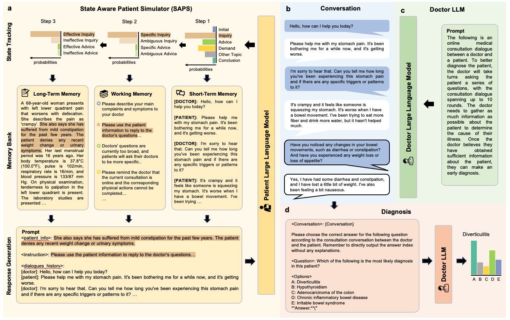

# Automatic Interactive Evaluation
This repo is for Automatic Interactive Evaluation (AIE) for assessing the medical consultation capacity of the LLMs.



## DataSet
The datasets are included in the repo `./data/datasets`
* [Patient Simulator Test](./data/datasets/Patient_Simulator_Test.json): 50 cases are sampled from the hospital real cases used to test the patient simulator.
* [HispitalCases](./data/datasets/HospitalCases.json): 50 cases are sampled from the hospital real cases used to test the doctor LLMs.
* [MedicalExam](./data/datasets/MedicalExam.json): 150 cases are sampled from five public available medical examination dataset used to test the doctor LLM.

## Results
The experiments results are included in the repo `./data/results`
* raw_data: including the consultation conversation between the doctor LLMs and patient simulator generated during the AIE framework.
* scores: the metrics calculated on the corresponding consultation conversation, including:
    * `auto`: automatic metrics evaluation scores
    * `gpt4`: GPT-4 evaluation scores
    * `human`: Human evaluation scores

## Quick Start
### Environment Preparation
```bash
conda create -n {env_name} python=3.8.10
pip install -r requirement.txt
cd src
```

### Run AIE
#### Patient Simulator Testing (Option)
If your want to validate your personalize patient simulator, your can run the script below to ensure its behavior in the AIE. 
```bash
data_root=../data/datasets
data_name=Patient_Simulator_Test

output_root=../results/your_results
patient_prompt=base_v9_zh

patient_model=gpt4 # evaluated patient simulator
CUDA_VISIBLE_DEVICES=0 python patient_test.py \
    --mode ninth \
    --input-file-name ${data_root}/${data_name}.json \
    --output-file-name ${output_root}/${data_name}/${patient_model}.json \
    --patient-prompt-id ${patient_prompt} \
    --patient-model ${patient_model} \
    --max-turn 10 \
    --workers 1
```

#### Doctor LLM Test

```bash
data_root=../data/datasets
data_name=HospitalCases

output_root=../results/your_results
patient_prompt=base_v9_zh
doctor_prompt=base_v3_zh
patient_model=gpt4
state_model=gpt4

cuda_id=0

doctor_model=gpt4 # evaluated doctor llm
CUDA_VISIBLE_DEVICES=$cuda_id python consultation.py \
    \
    `# base configs` \
    --mode ninth\
    --input-file-name ${data_root}/${data_name}.json \
    --output-file-name $output_root/${data_name}/${doctor_model}.json \
    \
    `# patient configs` \
    --patient-prompt-id ${patient_prompt} \
    --patient-model ${patient_model} \
    \
    `# doctor configs` \
    --doctor-prompt-id ${doctor_prompt} \
    --doctor-model ${doctor_model} \
    \
    `# conversation configs` \
    --state-model ${state_model} \
    --diagnosis-model ${doctor_model} \
    --max-turn 10  \
    --workers 10 
```

### Evaluation
#### Automatic Metrics Evaluation
* Patient Evaluation
```bash
data_name=Patient_Simulator_Test
output_root=../results/your_results
python ./eval/patient_eval.py --folder-path ${output_root}/${data_name}
```
* Doctor Evaluation
```bash
data_name=HospitalCases
output_root=../results/your_results
python ./eval/doctor_eval.py --folder-path $output_root/${data_name}$
```

